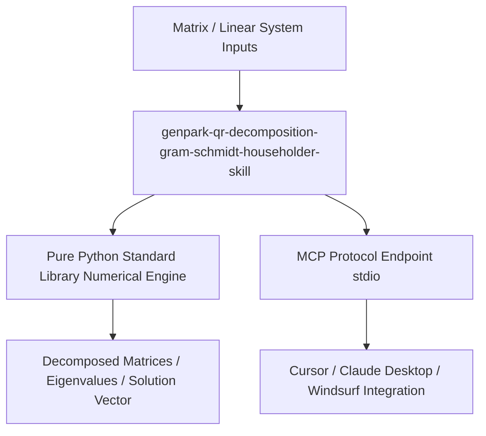

# genpark-qr-decomposition-gram-schmidt-householder-skill

[](https://github.com/alphaparkinc/genpark-qr-decomposition-gram-schmidt-householder-skill)
[](https://www.python.org/)
[](LICENSE)
[-brightgreen.svg)](client.py)
[](mcp_server.py)

> **QR matrix factorization via Gram-Schmidt orthogonalization for least-squares regression**

Part of the **GenPark Autonomous Agent Matrix**, developed for production AI agents operating across numerical, financial, and scientific computing stacks.

---

## 🏗️ Architecture



## 🚀 Quickstart

### Native Python Execution
```bash
python example_usage.py
```

### Standard Library Verification
```python
from client import *
```

### MCP Server (Claude Desktop / Cursor)
```json
{
  "mcpServers": {
    "genpark-qr-decomposition-gram-schmidt-householder-skill": {
      "command": "python",
      "args": ["-m", "genpark_qr_decomposition_gram_schmidt_householder_skill.mcp_server"]
    }
  }
}
```

## 📄 License
MIT License.
